# OLTP Schema — Entity-Relationship Diagram

The foundational OLTP layer for Meridian Valley Credit Union (MVCU), the
fictional CU behind the semantic-layer demo. Source of truth: `olap/oltp/schema.sql`.

The model is **intentionally not normalized to a single generic "balance" or
"interest rate" column**. A shared `account` core plus one typed child table
per line of business (Table-Per-Type) means each LOB stores its own version of
"balance" and "rate" under its own name and sign convention. That polymorphism
is the fuel for the semantic layer (see `data-dictionary.md` for the ambiguity
notes).

## Mermaid ERD

```mermaid
erDiagram
    HOUSEHOLD ||--o{ MEMBER : "groups retail members"

    MEMBER {
        bigint member_id PK
        uuid household_id FK "null for business"
        text member_type "individual|business"
        bigint business_id FK "contact-of (self)"
        text legal_name
    }

    TEAM ||--o{ STAFF : "staffs"
    STAFF {
        int staff_id PK
        int team_id FK
        text role "agent|specialist|supervisor"
    }

    PRODUCT ||--o{ ACCOUNT : "instantiated as"
    PRODUCT {
        int product_id PK
        text lob "mortgage|home|car_insurance|banking|cards|investments"
    }
    PRODUCT ||--o{ PRODUCT_RATE : "posted rates"
    PRODUCT_RATE {
        text rate_type "note|purchase_apr|cash_advance_apr|base|apy"
        bool is_teaser
    }

    MEMBER ||--o{ ACCOUNT : "primary owner"
    STAFF |o--o{ ACCOUNT : "opened_by (nullable)"

    ACCOUNT {
        bigint account_id PK
        int product_id FK
        bigint primary_member_id FK
        text status "open|closed|delinquent|charge_off"
    }

    ACCOUNT ||--o{ ACCOUNT_OWNER : "has owners"
    MEMBER ||--o{ ACCOUNT_OWNER : "owns (joint/auth)"
    ACCOUNT_OWNER {
        text ownership_role "primary|joint|authorized_user"
    }

    %% Table-Per-Type: one typed child table per line of business (1:0..1)
    ACCOUNT ||--o| MORTGAGE_ACCOUNT : "note_rate, current_principal, LTV"
    ACCOUNT ||--o| HOME_EQUITY_ACCOUNT : "base_rate + margin, drawn_balance"
    ACCOUNT ||--o| AUTO_INSURANCE_POLICY : "premium, deductible"
    ACCOUNT ||--o| BANKING_ACCOUNT : "ledger_balance, available_balance, apy"
    ACCOUNT ||--o| CREDIT_CARD_ACCOUNT : "purchase_apr, outstanding_balance"
    ACCOUNT ||--o| INVESTMENT_ACCOUNT : "market_value, ytd_return_pct"

    ACCOUNT ||--o{ ACCOUNT_TRANSACTION : "ledger entries (flows)"

    MEMBER ||--o{ RATE_LOCK : "locks rate"
    PRODUCT ||--o{ RATE_LOCK : "locked product"

    INTERACTION_CATEGORY ||--o{ INTERACTION : "categorized"
    MEMBER ||--o{ INTERACTION : "caller"
    STAFF ||--o{ INTERACTION : "handled"
    INTERACTION {
        bigint interaction_id PK
        text outcome "resolved|escalated|..."
    }

    INTERACTION ||--o{ INTERACTION_ACCOUNT : "about accounts"
    ACCOUNT ||--o{ INTERACTION_ACCOUNT : "referenced by"
    INTERACTION_ACCOUNT {
        text account_role "subject|referenced"
    }

    INTERACTION ||--|| INTERACTION_TRANSCRIPT : "1:1 utterances"
    INTERACTION ||--o| CSAT_SURVEY : "0..1 survey"
```

## Cardinality notes (the traps)

- **`account_owner` and `interaction_account` are the two true many-to-many
  junctions.** They create the classic double-counting ambiguities: counting
  `account` rows vs distinct `member` rows vs `household` rows all give
  different answers, and a single `interaction` can be "about" more than one
  `account` (about 20% of calls are multi-account).
- **`account` → LOB child tables are `1 : 0..1`.** Every account has exactly
  one LOB (via `product.lob`), so exactly one of the six child rows exists.
  This keeps each LOB's columns strongly typed instead of a wide nullable blob.
- **`interaction_transcript` is 1:1** with `interaction` and mirrors
  `transcripts.json` exactly (`utterances` JSONB = the `transcript` list the
  RAG pipeline already consumes).
- **`csat_survey` is 0..1 per interaction** — about 75% of calls get surveyed.
  In the seed data `survey_id == interaction_id` (see data dictionary).
- **`rate_lock` and `account_transaction` are independent subjects** — the
  lock pipeline ("lock" as a mortgage event) vs ledger flows ("balance" as a
  stock-vs-flow), both of which the semantic layer must keep apart.