# Star / Snowflake Schema — Meridian Valley Credit Union

The OLAP layer built by the `olap/dbt` project over the OLTP foundation
(`olap/oltp/schema.sql`). This is §6 of the demo plan: a star of fact tables
surrounded by conformed dimensions, with two deliberate snowflakes
(`d_account → d_product`, `d_staff → d_team`) so the LOB discriminator
(`product.lob`) and staffing function areas stay in one place.

Design rule that drives the whole shape: **there is no generic `balance` or
`interest_rate` column.** Every fact measure is lob-qualified and null-per-type
(`mortgage_note_rate`, `purchase_apr`, `deposit_apy`, `card_outstanding_balance`, …),
so the semantic layer is forced to give each colliding spoken word its own
declared metric. The diagram below is the physical picture of that rule.

## Mermaid diagram (facts + dimensions)

```mermaid
erDiagram
    %% ── Dimensions (conformed) ────────────────────────────────────────────
    d_date {
        int date_key PK
        date date_day
        int year_number
        int month_number
        int quarter_number
    }
    d_time {
        int time_key PK
        int hour_of_day
        text time_of_day_bucket
    }
    d_household {
        uuid household_id PK
        text income_band
    }
    d_member {
        bigint member_id PK
        uuid household_id FK "null for business"
        text member_type
        text credit_score_band
        text residence_state
    }
    d_team {
        int team_id PK
        text function_area
    }
    d_staff {
        int staff_id PK
        int team_id FK
        text role
    }
    d_category {
        text category_code PK
        text category_name
    }
    d_product {
        int product_id PK
        text lob "the discriminator"
    }
    d_account {
        bigint account_id PK
        int product_id FK "snowflake"
        bigint primary_member_id FK
        text status
        %% lob-qualified, null-per-type columns (note_rate, purchase_apr, apy, ...)
    }
    d_channel {
        text channel_code PK
    }
    d_outcome {
        text outcome_code PK
    }
    d_account_status {
        text account_status_code PK
    }

    %% ── Facts (stars) ───────────────────────────────────────────────────────
    f_interaction {
        bigint interaction_id PK
        bigint member_id FK
        int staff_id FK
        int team_id FK "denormalized"
        text category_code FK
        int duration_seconds
        boolean first_contact_resolved
    }
    f_interaction_account {
        bigint interaction_id FK "bridge grain"
        bigint account_id FK
        text account_role
    }
    f_csat {
        bigint survey_id PK
        bigint interaction_id FK
        bigint member_id FK
        int score
        boolean is_promoter
        boolean is_detractor
    }
    f_account_snapshot {
        bigint account_id FK "account x snapshot_date"
        date snapshot_date
        bigint member_id FK
        numeric mortgage_note_rate
        numeric purchase_apr
        numeric deposit_apy
        numeric card_outstanding_balance
        numeric banking_available_balance
    }
    f_transaction {
        bigint transaction_id PK
        bigint account_id FK
        bigint member_id FK
        numeric amount "signed"
        text txn_type
    }
    f_rate_lock {
        bigint lock_id PK
        bigint member_id FK
        int product_id FK
        numeric loan_amount
        text status
    }
    f_rate {
        bigint product_rate_id PK
        int product_id FK
        date effective_date
        numeric rate_value
    }

    %% ── Snowflake + star joins ──────────────────────────────────────────────
    d_member ||--o{ d_household : "household groups members"
    d_staff ||--o{ d_team : "staff grouped into teams"
    d_account ||--o{ d_product : "snowflake: LOB discriminator"

    f_interaction }o--|| d_member : "caller"
    f_interaction }o--|| d_staff : "handled by"
    f_interaction }o--|| d_category : "categorized"
    f_interaction }o--|| d_date : "interaction_date"
    f_interaction_account }o--|| f_interaction : "about accounts (m2m bridge)"
    f_interaction_account }o--|| d_account : "referenced account"

    f_csat ||--o| f_interaction : "0..1 survey"
    f_csat }o--|| d_member : "member"

    f_account_snapshot }o--|| d_account : "snapshot of"
    f_account_snapshot }o--|| d_member : "owner"
    f_account_snapshot }o--|| d_date : "snapshot_date"

    f_transaction }o--|| d_account : "ledger entry"
    f_transaction }o--|| d_member : "member"

    f_rate_lock }o--|| d_member : "locks"
    f_rate_lock }o--|| d_product : "locked product"

    f_rate }o--|| d_product : "posted rate"
```

## How the ambiguity maps onto this shape

| Spoken word | Physical place in the star | Discriminator |
|---|---|---|
| **interest rate** | `f_account_snapshot.mortgage_note_rate` / `.heloc_current_rate` / `.purchase_apr` / `.cash_advance_apr` / `.deposit_apy` / `.investment_return_pct` + `f_rate.rate_value` | `d_product.lob` (+ rate_type) |
| **balance** | `.banking_available_balance` (asset) vs `.card_outstanding_balance` (**liability**) vs `.investment_market_value` vs `.escrow_balance` … | `d_product.lob` + sign convention (declared in metrics, never in a column) |
| **LCV / LTV** | LTV = `.ltv_at_origination` (a fact); LCV = derived metric (no column exists) | definition, not table |
| **limit** | `.card_credit_limit` / `.heloc_credit_limit` (capacity) vs `.insurance_deductible` (coverage) | `d_product.lob` |
| **principal** | `.mortgage_principal_balance` (stock) vs `f_transaction` principal flow | stock vs flow |
| **lock** | `f_rate_lock.status` (pipeline) vs `f_interaction.outcome` (fraud freeze) | fact vs fact |

The two fact-to-fact traps — `f_interaction_account` (interaction x account
many-to-many) and the stock-vs-flow split between `f_account_snapshot` and
`f_transaction` — are drawn so a reader can see exactly where a naive join
would double-count or add assets to liabilities. The MetricFlow declarations
(`models/marts/semantic/`) make those joins unrepresentable.